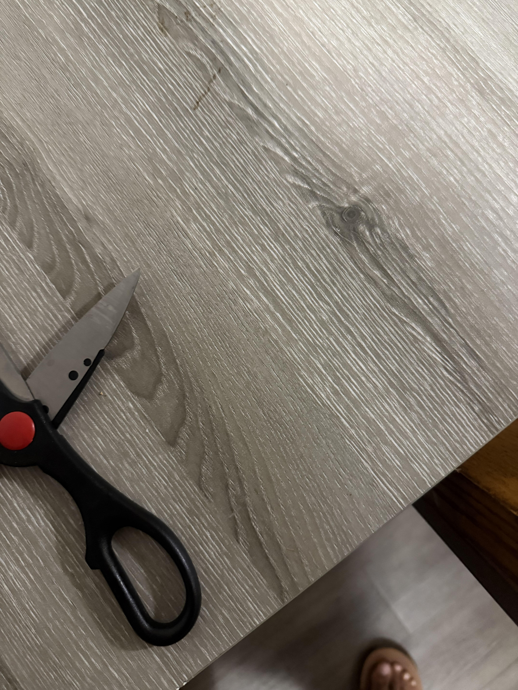

# A1 – [Topic]

## Objective

## Analyze
Task A - Portfolio Analysis
Portfolio 1 - [Nathan Hoong Engineering Portfolio]
Portfolio URL: [ https://nhoong.github.io/]
Navigability:
In the first 60 seconds of opening this portfolio I was able to see a little bit of Nathan's engineering background such as what projects he has worked on and how his skills he has learned from these various projects has helped him through ought his engineering career. As I scroll down a little more, I see that his clear objective is to create a testing machine to simulate how medical devices interact with the human eye and areas around it.
Reproducibility:
Looking through Nathan's project on PLIF he states what tool he has created and what it is used for. Explaining what type of mechanics, it uses and how this tool is effective since it allows for adjustment and is easy to release the tool. He also has a CAD module that shows the assembled tool and has multiple cad modules on each component that is in the tool. 
Evidence of reasoning:
Nathan provides engineering reasoning explaining why different features are used in his designs and how it was assembled. He doesn't just show the final product he describes how certain design changes has improved his project.
Professional tone:
Overall, Nathans Portfolio is strong. His site gives us a good insight on his engineering background, states his objectives/results and improvements through his journey and includes his resume and LinkedIn. His overall writing is general, but it gets the job done and is very understanding.
Portfolio 2 - [Allister Sequeira Mechanical Engineering Portfolio]
Portfolio URL: [https://allisterjsequeira.github.io/index.html]
Navigability:
Withing the first 60 seconds I was able to locate links to each project Allister has done. Also, on the top navigation bar has organized links with his resume, about his engineering studies and how to contact him making finding specific information very easy to access.
Reproducibility:
Looking through Allister FSAE Chassis project, he clearly explains what his project is focusing on developing, how it was developed and tested to ensure it works correctly. He also explains how parts like the CATIA V5 was used for CAD models and ANSYS was used for FEA testing, including very useful images of crash simulation and torsional stiffness analysis. If An engineer was given this information on his project, it would be very helpful being able to look at his CAD modules, pictures of the actual chassis being assembled, and welding fixture used during fabrication. The only thing that would be a struggle for engineers to redesign this exact module would be the fact that Allister doesn't include the exact dimensions used or the materials used.
Evidence of reasoning:
Allister has a solid engineering reasoning explaining why certain parts and testing methods were used in this chassis design. Using FEA to show how the chassis handles stress and deformation. He then shows how he implements a torsional stiffness test rig to compare his computer results to the actual chassis, which shows that his design was developed by testing and improving performance.
Professional tone:
Allister portfolio is professionally oriented since he sticks to describing the process of engineering, the software that was included and the outcome of the the project. He uses very technical terms (such as CAD, FEA, torsional stiffness, and fabrication) but still keeps the descriptions clear and understanding. Also includes all important information on how to contact him and about his engineering journey.

Task B - Product Analysis
Product: Scissors
Primary Function:
The main purpose of scissors is to transmit the force applied at the handles into cutting effort at the blades. The blades turn about the pivot point and cut the substance that is placed between them. 
Governing Model:
Scissors consist of two levers rotating about one common pivot. The conventional scissors are constructed based on the principle of moments about the pivot point.
FhLh=FcLc
Where:
Fn = force applied at handles 
Lh = distance from the pivot to where the hand force is applied
Fc = cutting force at blades
Lc= distance from the pivot to where the material is being cut
The longer the handle distance is the more cutting force is at the blades
Assumption: The handles and blades are assumed to act and stay rigid and not significantly bend while cutting

Photo 1 - Handle Geometry:
With a long handle and wide finger hole, the user is given sufficient leverage for the force application. The further length from the pivot to the hand enables the user to generate cutting force at the blades.

Photo 2 - Pivot and Blade Geometry:
With the pivot, the two blades are made to rotate about one point. The pivot also holds the blades such that the cutting edges slide past each other creating a shearing action of the blade

Photo 3 - Scissors Overall Geometry:
With the long handles, the blades are connected to the handles by way of the pivot, whereby the force applied by the user is transferred to the blades.

Patent Research:
Patent Number - US3376641A
Inventor - Andrew C Usborne
Alternative solutions - The functions of a paper cutter and a rotary cutter are the same, in the sense that they both separate material through a cutting action
Design Decision - One of the design decisions made in the patent is to incorporate the use of angles around the pivot point to make sure the two blades are always in touch during opening and closing of the scissors

## Decide
Homepage Identity - The homepage should make it clear right away that the portfolio represents a collection of my engineering work and the steps taken in the design process. Someone visiting the site should know what kind of work it is and how the portfolio is laid out so that they could find specific assignments. The layout of the homepage should be straightforward and allow an instructor or an employer to get a good sense of the purpose of the portfolio

Customizing Intentionally - One modification that I introduced in the template is putting my name in the title of the homepage. This immediately helps identify the person to whom the portfolio belongs. In the original template, there was just the course title, but nothing that identified the student. My addition has thus made the homepage more useful for an audience that sees the portfolio for the first time.

Standard for Documentation - For every assignment, I will thoroughly describe my process of engineering and provide the relevant calculations or evidence so that any other engineering student is able to comprehend how I arrived at my conclusions. 

## Communicate

