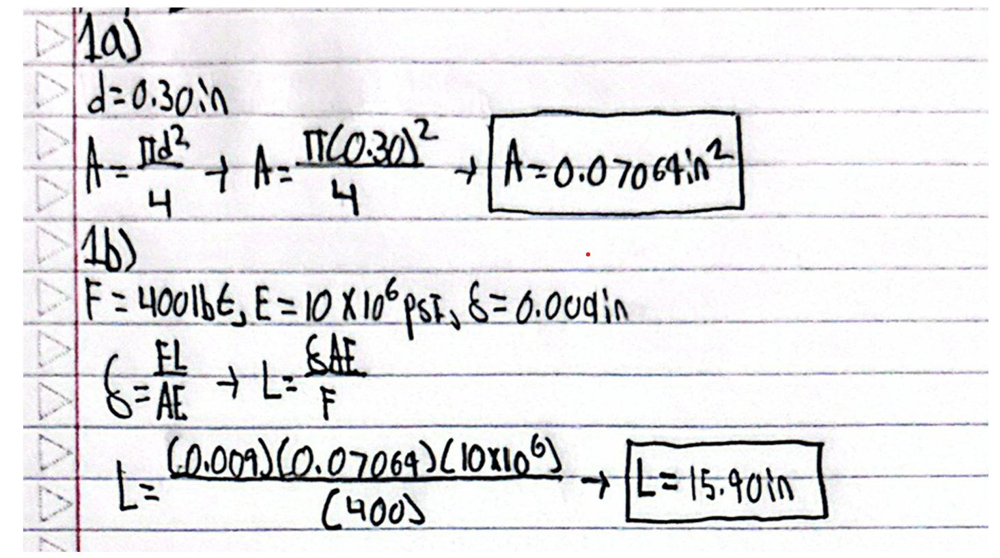
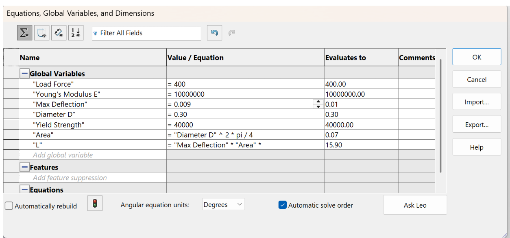
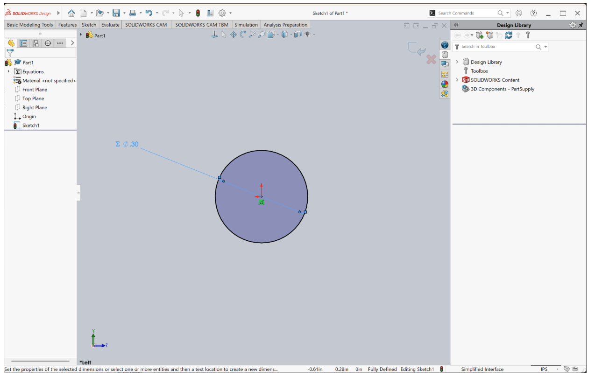

# A3 – Parametric and FEA
Introduction

For this particular assignment, I have done parametric modeling of an aluminum bar in SolidWorks and have also performed the validation through finite element analysis in SolidWorks. This aluminum bar has been designed such that its maximum axial deflection is 0.009 in under axial tensile loading of 400 lbf

Design/Calculations

In my first design, I chose a round bar with a diameter of 0.30 inches. Using the area calculation for circular section formula gave me the area to be 0.07069 in^2

When I used the direct Tension deflection formula with 400 lbf load, modulus of elasticity of 10 *10^6 psi, and max deflection of 0.009 inches, the length of the bar comes to be 15.90 inches

Material/Global Equations

After the analysis had been completed, the data was inputted into SolidWorks as global variables. These variables are as follows: Load force, Young's modulus, maximum deflection, diameter, yield strength, area, and beam length.

The area and length of the beam have been defined using an equation such that any change in the design parameters will be reflected in the model.

Cad Modeling

The circular cross-sectional area of the bar was created in SolidWorks with a diameter of 0.30 inches. This particular dimension is associated with the global parameter used in parametric model.

Once the circle was drawn, the bar was then extruded using the dimension of 15.90 in. The resulting object became the cad model used in the finite element analysis

