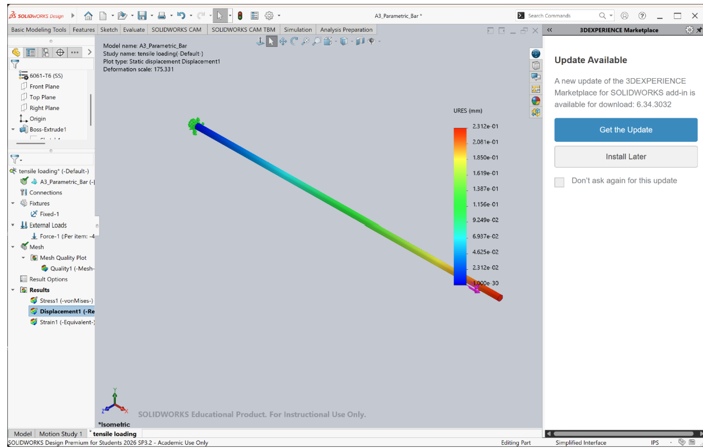
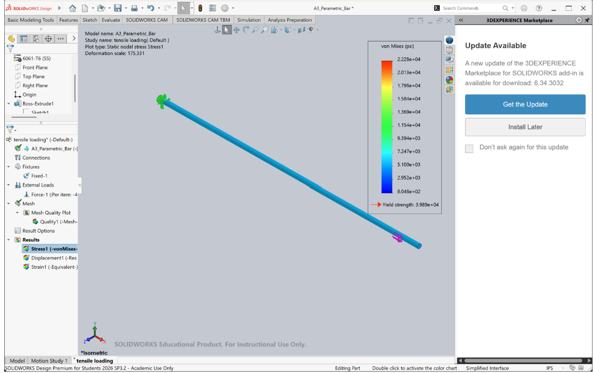
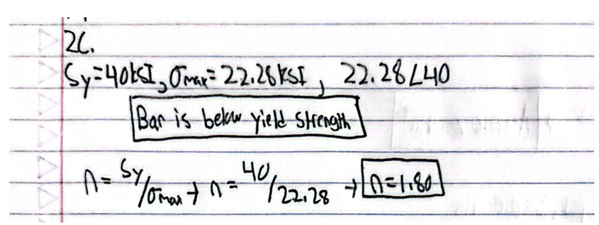

# A3 – Parametric and FEA
Introduction

For this particular assignment, I have done parametric modeling of an aluminum bar in SolidWorks and have also performed the validation through finite element analysis in SolidWorks. This aluminum bar has been designed such that its maximum axial deflection is 0.009 in under axial tensile loading of 400 lbf

Design/Calculations

In my first design, I chose a round bar with a diameter of 0.30 inches. Using the area calculation for circular section formula gave me the area to be 0.07069 in^2

When I used the direct Tension deflection formula with 400 lbf load, modulus of elasticity of 10 *10^6 psi, and max deflection of 0.009 inches, the length of the bar comes to be 15.90 inches

Material/Global Equations

After the analysis had been completed, the data was inputted into SolidWorks as global variables. These variables are as follows: Load force, Young's modulus, maximum deflection, diameter, yield strength, area, and beam length.

The area and length of the beam have been defined using an equation such that any change in the design parameters will be reflected in the model.

Cad Modeling

The circular cross-sectional area of the bar was created in SolidWorks with a diameter of 0.30 inches. This particular dimension is associated with the global parameter used in parametric model.

Once the circle was drawn, the bar was then extruded using the dimension of 15.90 in. The resulting object became the cad model used in the finite element analysis

Simulation/FEA

One end of the beam was clamped while the other end was subjected to a tensile force of 400lbf. After performing the analysis, I generated the displacement plot given below.

The maximum displacement value from the FEA is 0.2312mm, which is equivalent to 0.00910in. The displacement is almost equal to the maximum displacement of 0.009 in that I assumed during my manual calculations. 

I then checked the results of the von Mises stress through FEA. The maximum stress value in the bar is about 22.28ksi.

As per the assignment details, the yield strength of the aluminum material is 40ksi.

Safety Factor:

The Von Mises Stress Maximum value was obtained from the results of the FEA simulation and compared to the yield strength of the Aluminum material in order to get the factor of safety.

40ksi>22.8ksi

Factor of safety = 40/22.28

Factor of Safety = 1.80

The maximum stress being less than the yield strength means that safety has been achieved with the factor of safety of 1.80.

Design Reflection:

The manual axial deflection was 0.0090 in whereas the FEA gave 0.00910 in.

The percentage difference was approximately

Percent Difference = (0.00910 - 0.00900) / 0.00900 * 100

Percent Difference = 1.11%

These values are quite close since the bar has a uniform circular section and is subjected to axial loading. There are no significant stress concentrations on the original bar; hence, both solutions should yield similar values.

I would trust the analytical solution a bit more for this problem due to the simple geometry of the loading since the analytical solution uses the direct tension equation. However, FEA is still valuable as it verifies the analytical solution and shows the full stress and deformation fields of the bar.

For the new pin-hole portion, the peak stress could be determined by multiplying the nominal stress by the stress concentration factor as follows:

Peak stress = Kt * Nominal Stress

This value will be used to compare the strength with the 40 ksi yield strength.

Lesson Learned:

In this exercise, I got to learn how to make use of global variables and equations in SolidWorks for making a parametric model. I also learned how to apply materials, fixtures, and loads, conduct a FEA, and how to understand the results of displacements and von Mises stress.

The problem I faced during this exercise is that SolidWorks crashed after I had completed my simulation. Alough I had taken screenshots of my results, I did not have access to my simulation study.

Total time spent: 5.5 hours

CAD File: 

