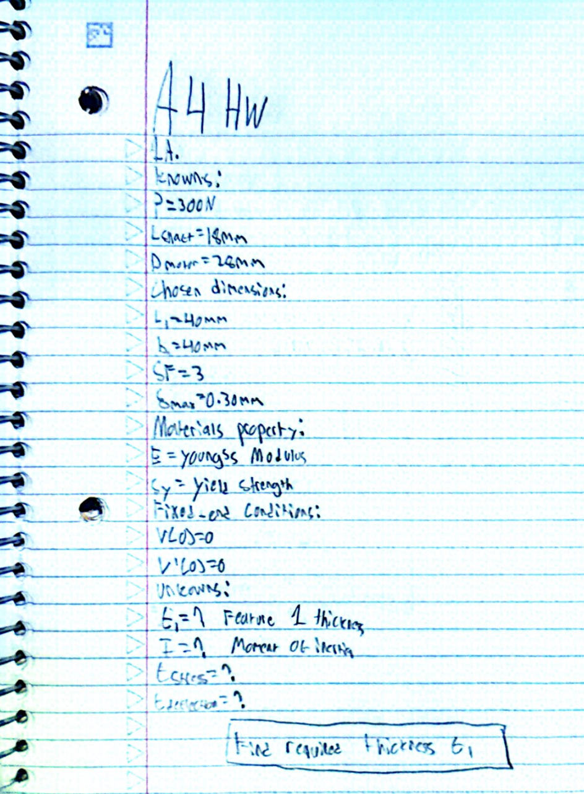

# A4 – Motor Mount

 Objective/Description:
 Purpose of the Lab Activity. This lab activity sought to design a motor mounting which is going to be utilized in a brushed 24v DC gear motor which will be installed on a rigid wall. In designing the motor mounting, two main aspects were considered. Element 1 - the motor is held by this aspect. Element 2 - This aspect mounts the entire assembly to a rigid wall. Stress and deflection consideration were performed in designing the motor mounting and the safety factor adopted in this case is 3 while the maximum allowable dlefection at the free end of 0.30mm. Load on the motor shaft adopted for the design is 300N.

Design Requirments:
- Applied load: P = 300N
- Motor shaft length: 18mm
- Motor face diameter: Approximately 28mm
- Safet Factor: 3
- Maximum allowable deflection: 0.30,,
- Feature 1 width: 40mm
- Feature 2 width: 40mm
- M3 bolt clereance diameter: 3.4mm
- Shaft Clearance: 6.5mm
For the beam calculations, the material-property values used were
- Young's Modulus: E = 3500n/mm^2
- Yields strength: 50N/mm^2

Feature 1:
For Feature 1, I used a width and length of 40mm. The 300N load acting through the 18mm shaft created a moment of 5400N*mm. I first identified my knows and unknowns and created a free-body diagram of the feature.

