# A5 – Bracket Design

## Objective
Designing a bracket that will satisfy both the strength and stiffness requirments through stress analysis, deflection analysis, and free body diagram was the aim of this exercise.

## Analyze

### Part 1 - Stress Analysis

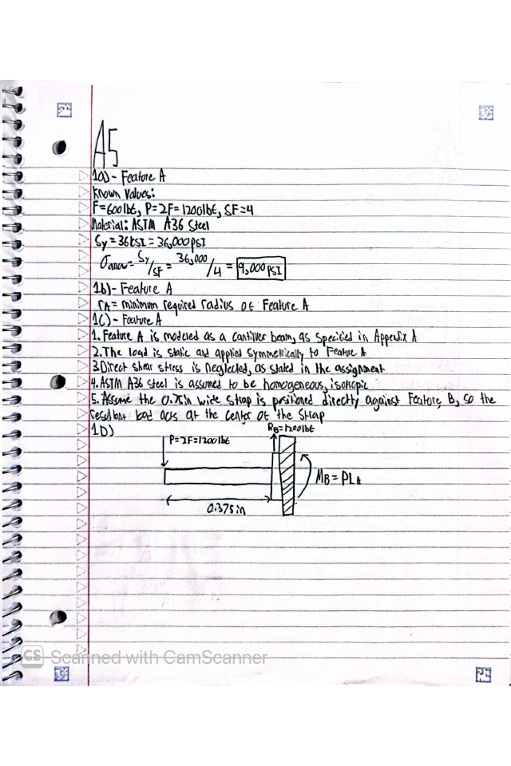

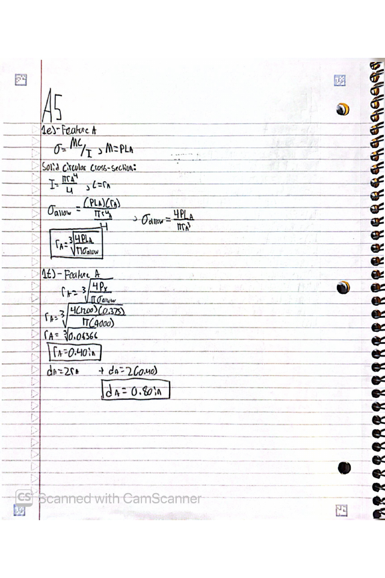

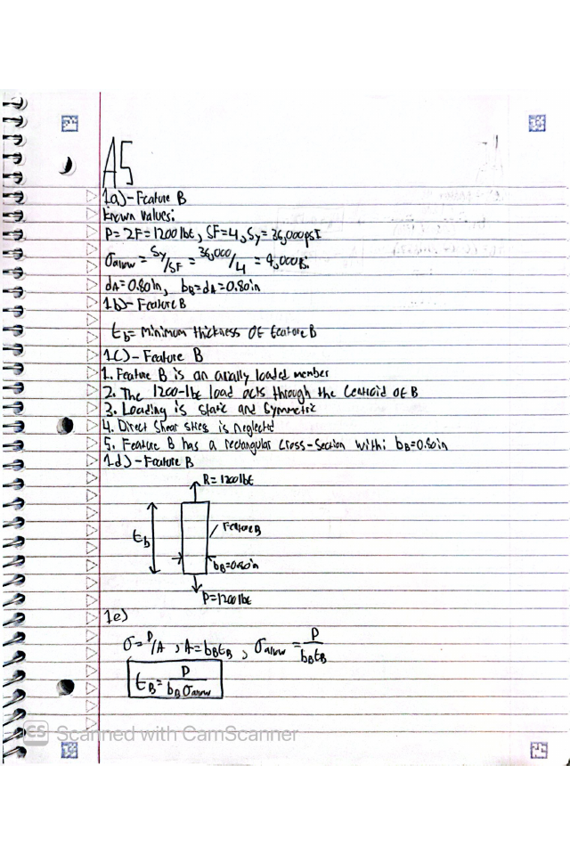

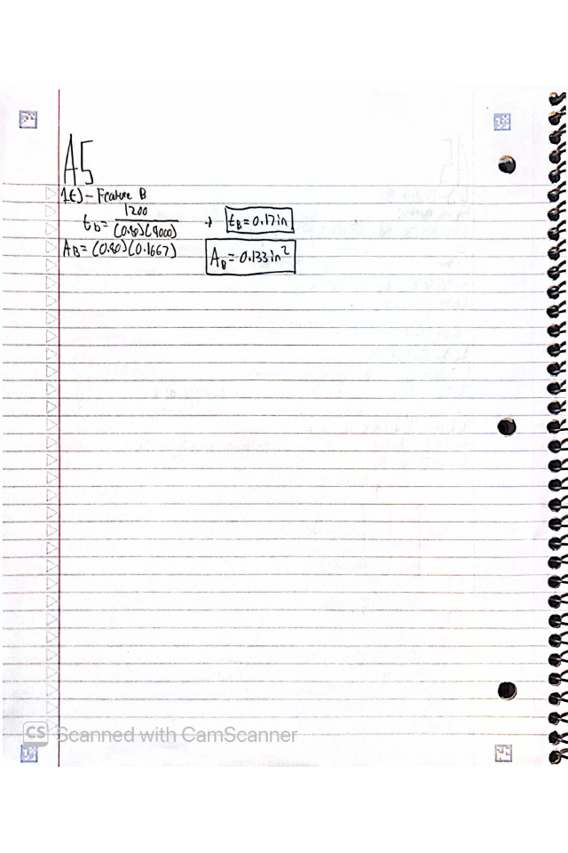

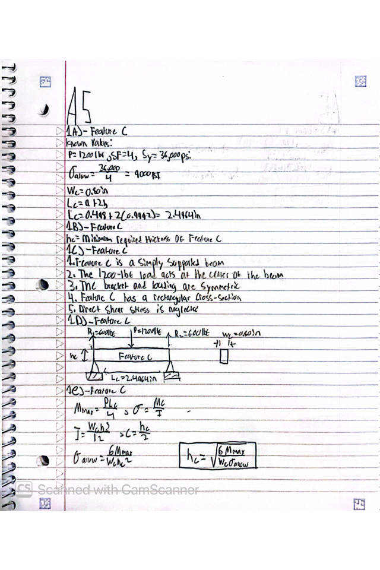

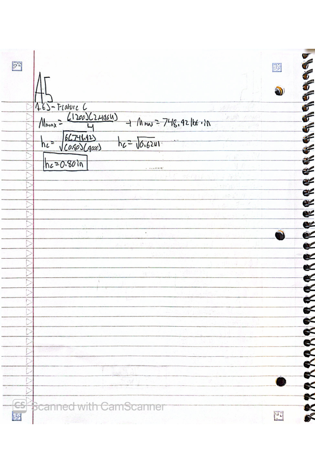

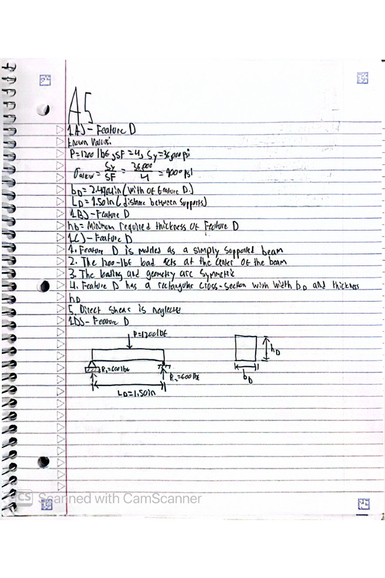

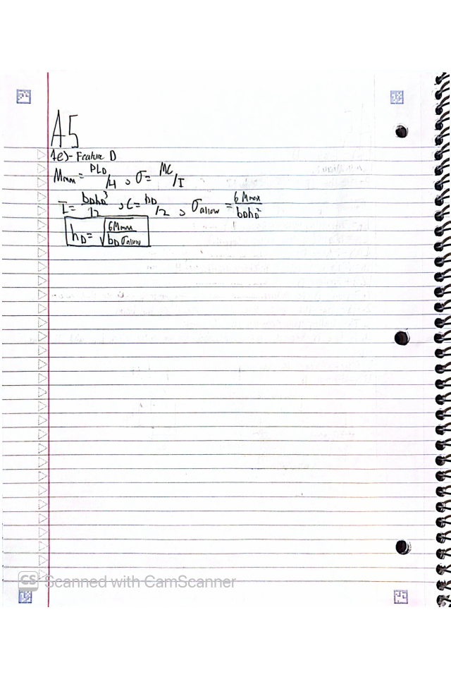

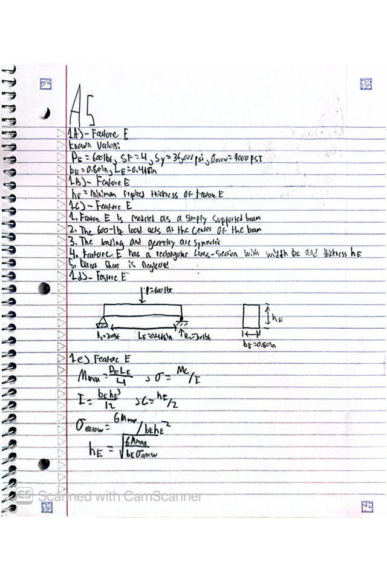

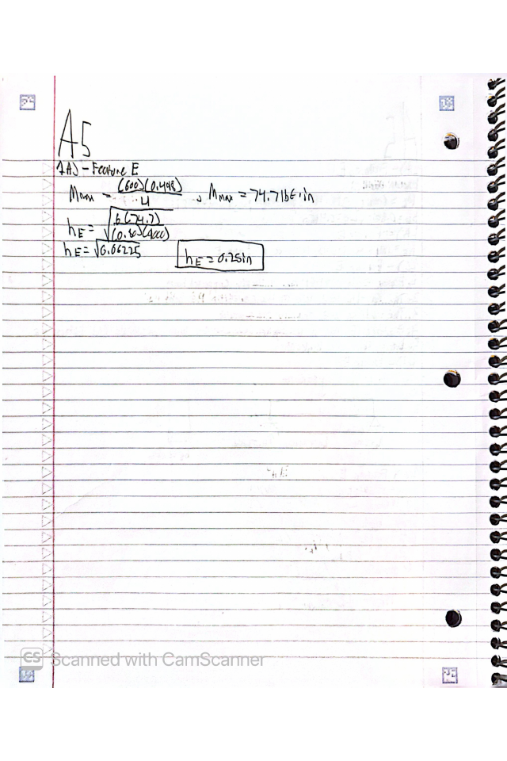

### Part 2 - Stiffness Analysis

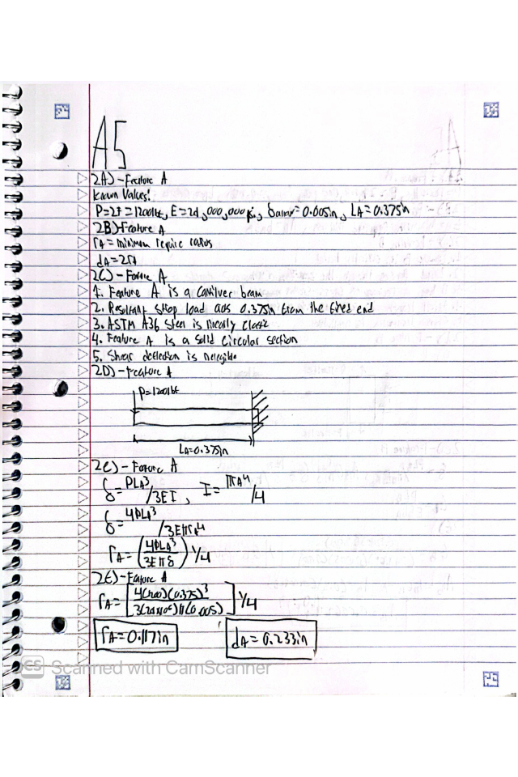

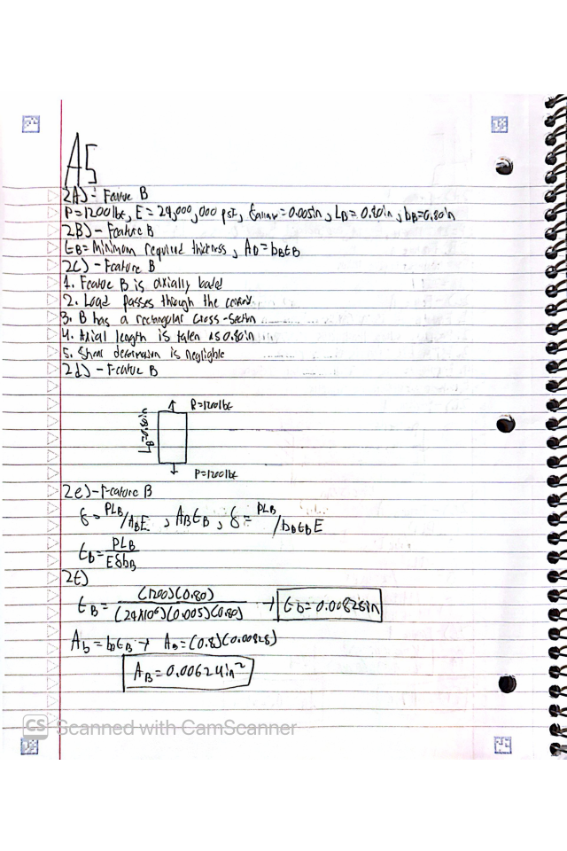

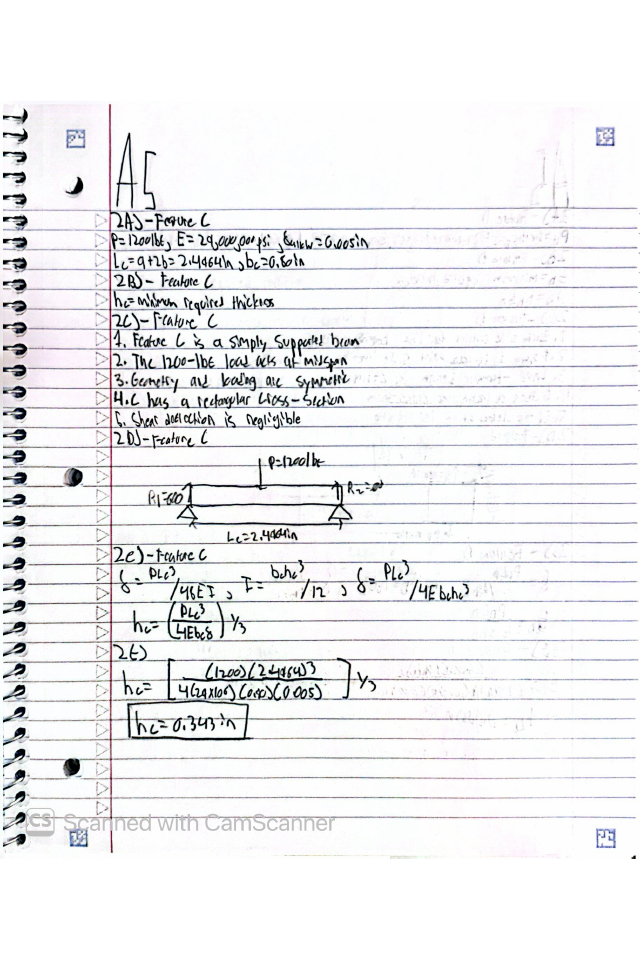

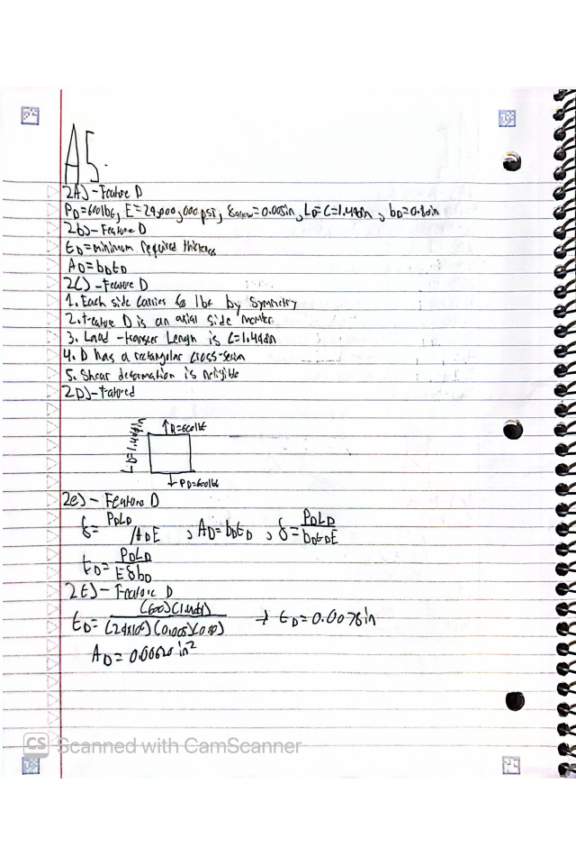

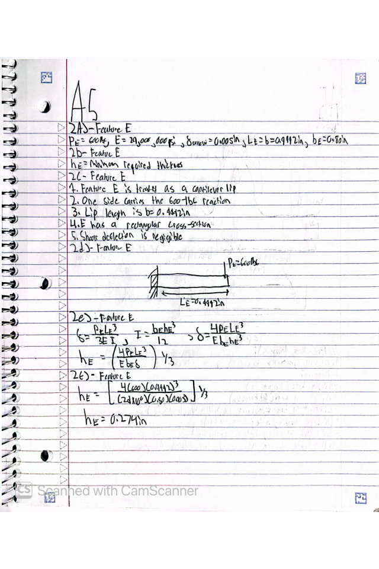

## Decide

### Part 3 - Multiview Sketches

#### Stress Analysis Multiview Sketch

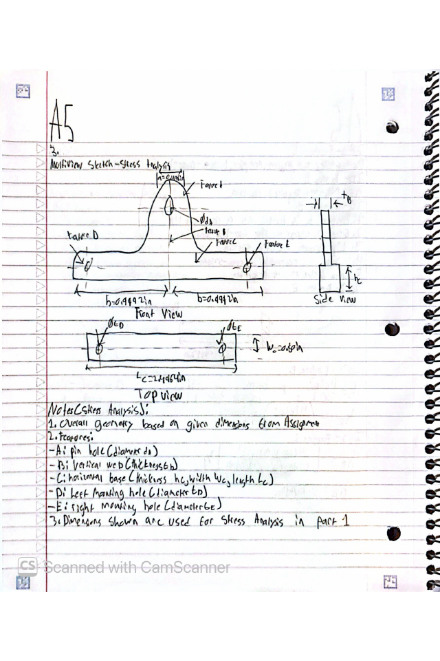

#### Stiffness Analysis Multiview Sketch

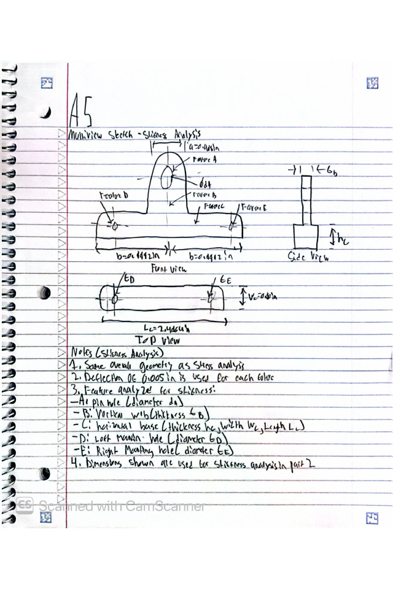

## Lesson Learned

4. Governing Failure Mode

Feature C needed a minimum thickness of 0.80 in for the stress analysis, while it required approximately 0.343 in for the stiffness analysis.
The difference was:

0.80 - 0.343 = 0.457in

Thus, the final dimension was governed by the stress condition and was approximately 0.457 in larger.

5. Error Propagation

An example of an error propagation is when there was an error in calculation of Feature A dimension and thus Feature B dimensions because Feature A dimension was used in determining the dimensions of Feature B.
Checking every result before its use for the next feature allows avoiding such problems.

6. Assumption Sensitivity

The one assumption which was very important in calculations was location and distribution of the load. 

For Feature A, the load location was assumed according to the position of the strap. IF the actual load acts further away from the support point than assumed, the bending moment and deflection would increase and this a larger Feature A diameter would be required to satisfy both the stress and stiffness condtions
