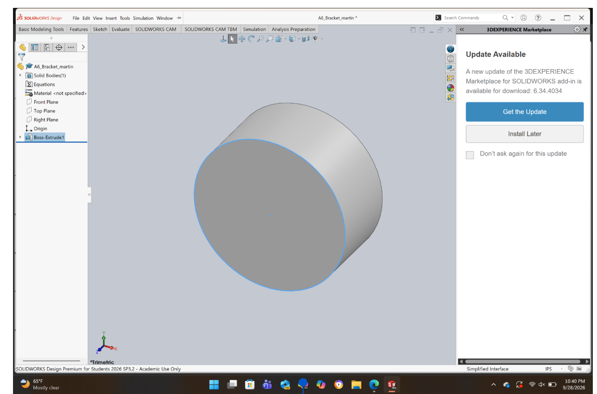
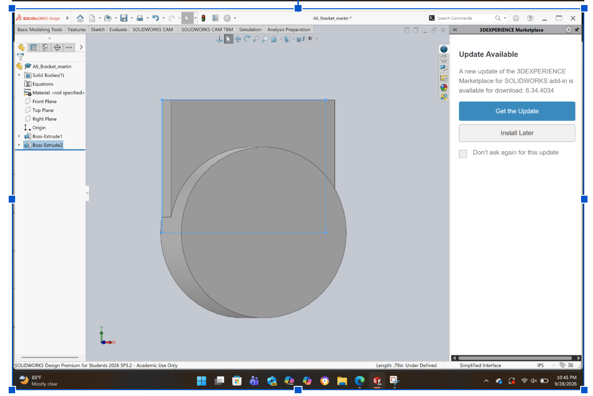
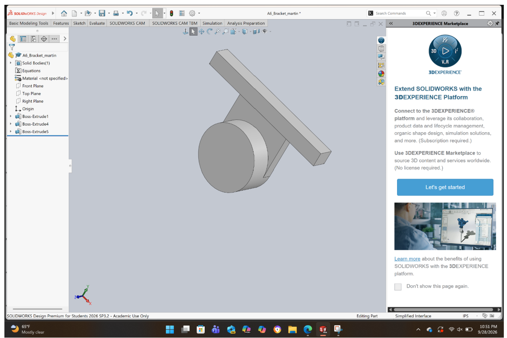
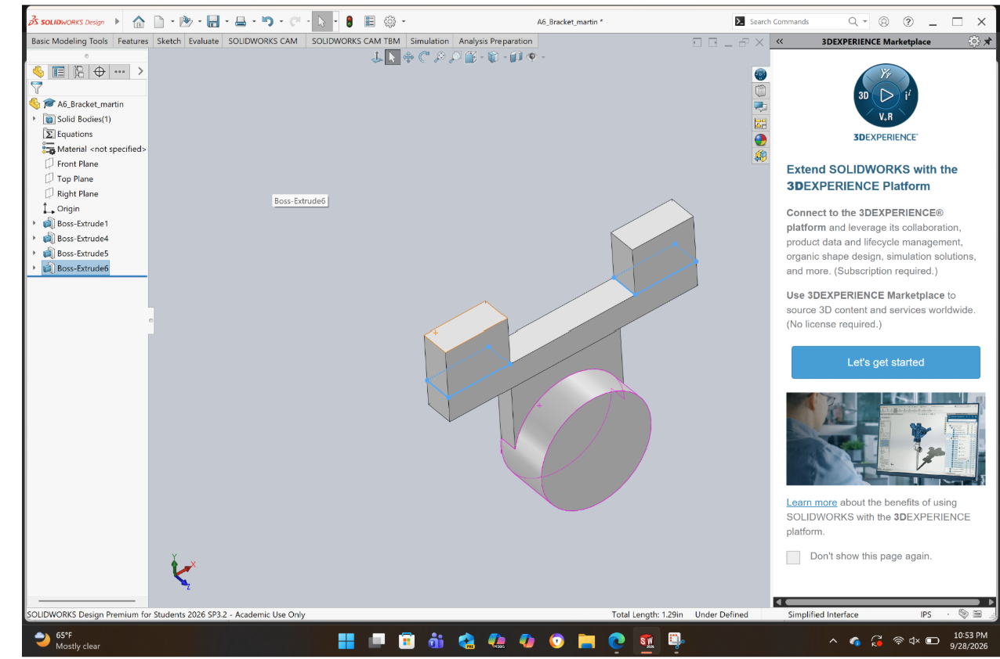
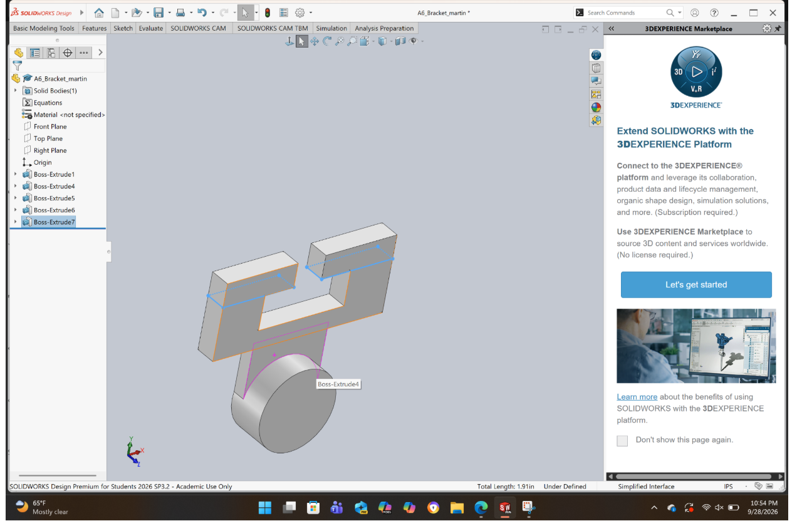
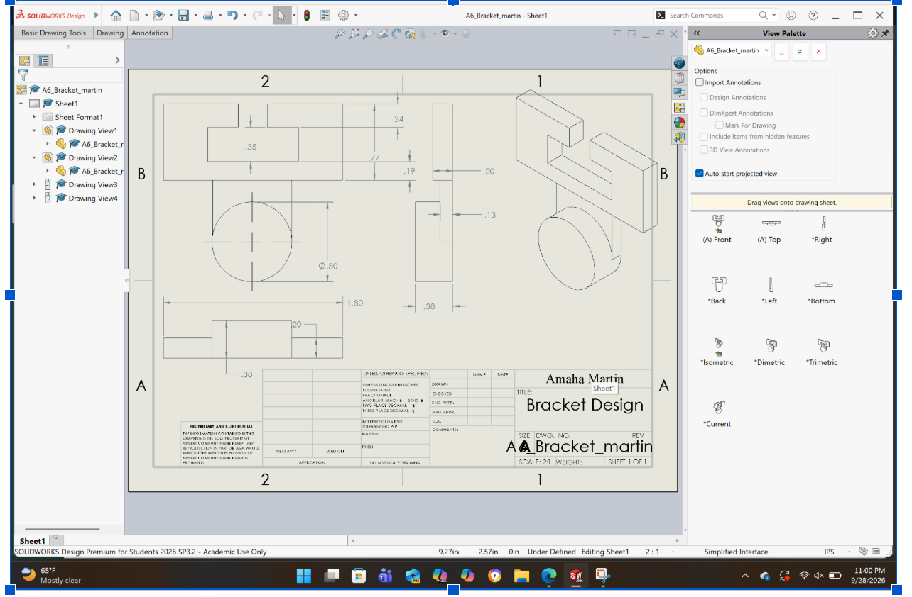

# A6 – Bracket Design

## Parametric Design
In this project, I have extended the design idea from A5 and made a full 3D model using SolidWorks. When I started working on the CAD model, I realized that there were certain dimensions that came out of my calculation but did not fit the desired geometric configuration of the bracket. As a result, I changed some dimensions in the middle of the design process while retaining the basic idea of the bracket design.

## Feature A

At the beginning, I created Feature A as the cylindrical part of the bracket, forming its lower part and serving as the base for the following connecting feature.

## Feature B

Feature B was added to join Feature A to the upper part of the bracket; its geometry being altered to stablish proper connections between these two parts in the final model.

## Upper Bracket Development

Then, the horizontal section was created to start forming the upper bracket. At that moment, I kept altering the dimensions of the design as needed.

After that, the upper features were created to form the bracket structure around them. The dimensions were adjusted from the previous A5 calculations as required to make the final geometry more pratical.

## Completed Bracket

The resulting bracket consists of Features A through E and represents the whole structure in one solid model. During the CAD, several dimensions were altered from the initial A5 values to create proper connections between all features and make the final geometry more accurate.

## Multiview CAD Drawing

The drawing provides several views of the final model as well as the dimensions of the bracket geometry.

## Reflections

The most significant lesson I learned during this assignment is that analytical dimensions do not necessarily mean that a CAD model is going to behave as expected. when creating the CAD model of the bracket, I came to the realization that some of the dimensions provided in A5 do not fit properly with the geometry of the model.

Therefore, several dimensions were adjusted during the creation of the CAD model. From this, I learned the importance of comparing the calculated data with the geometry of the CAD model. In addition, I learned about the advantages of the parametric modeling since it allowed me to make changes to the model by adjusting the dimensions using global variables and equations. In addition, another lesson I learned is about joining separate
features together to form one solid body. This was done by changing the direction of the extrusion and by merging results. Another lesson learned during this assignment is the importance of creating a multiview drawing.

## Lesson Learned

Through this task, I was able to realize that the design process can include modification of previous assumptions and dimensions. While A5 calculations were a good start, the A6 CAD design revealed areas where changes needed to be made.

The parametric CAD proved to be a valuable tool since modifications could be done faster due to controlling dimensions through variables.

## CAD File

